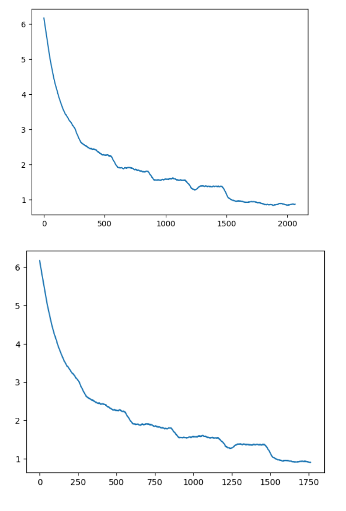

# CSE 455 Kaggle Final
## Richard Luu and Hao Le
### Video Link: 

## Overview
For our final project, we decided to participate in the biannual Bird Classification Competition on Kaggle. The goal of this competition is to classify the name of each bird accordingly to the image with the highest classification accuracy possible. For our work, we used Juypter and pytorch as the framework. With its extensive library, we were able to perform the training and produce our prediction. The neural network we used for the classification was the ResNet neural network architecture specifically, we used ResNet18 and Resnet152. 

## Starting our training 
For our project, we used the Jupyter notebook to run the code and a rented GPU from vast.ai to train our model. We used the python library PyTorch as the framework to develop our neural network for the competition.

```
import numpy as np
import matplotlib.pyplot as plt
import os

import torch
import torchvision
import torchvision.transforms as transforms
import torch.nn as nn
import torch.nn.functional as F
import torch.optim as optim

device = torch.device("cuda:0" if torch.cuda.is_available() else "cpu")
```

The GPU used in the training was a GTX 4090.

For our dataset, we used the provided data set provided by Kaggle. The dataset consists of 10000 images of various birds and their respective name. In our workspace, we used a series of command lines to unpack our uploaded kaggle.json file to generate the dataset.

```
Import Kaggle Dataset

! pip install -q kaggle
! mkdir ~/.kaggle
! cp kaggle.json ~/.kaggle/
! chmod 600 ~/.kaggle/kaggle.json
! kaggle competitions download -c birds23wi
! mkdir 'checkpoints'

# Create checkpoints folder to save models
checkpoints = '/workspace/checkpoints'
```

## Neural Network and Training

The notebook we created to train was adapted from the class tutorial code. With the code used, we fine-tuned and calibrated it to what felt appropriate to get the best result. 

### ResNet18

The model starts by loading the data for training, which is done with the existing code from the class tutorial. We wanted to have a baseline prediction, which we determine that keeping the values from the tutorial would be the best approach. 

```
# Method to load datasets

def get_bird_data(augmentation=0):
    transform_train = transforms.Compose([
        transforms.Resize(128),
        transforms.RandomCrop(128, padding=8, padding_mode='edge'), # Take 128x128 crops from padded images
        transforms.RandomHorizontalFlip(),    # 50% of time flip image along y-axis
        transforms.ToTensor(),
    ])
    
    transform_test = transforms.Compose([
        transforms.Resize(128),
        transforms.ToTensor(),
    ])
    trainset = torchvision.datasets.ImageFolder(root='/workspace/birds23wi/birds/train', transform=transform_train)
    trainloader = torch.utils.data.DataLoader(trainset, batch_size=128, shuffle=True, num_workers=2)

    testset = torchvision.datasets.ImageFolder(root='/workspace/birds23wi/birds/test', transform=transform_test)
    testloader = torch.utils.data.DataLoader(testset, batch_size=1, shuffle=False, num_workers=2)
    classes = open("/workspace/birds23wi/birds/names.txt").read().strip().split("\n")
    class_to_idx = trainset.class_to_idx
    idx_to_class = {int(v): int(k) for k, v in class_to_idx.items()}
    idx_to_name = {k: classes[v] for k,v in idx_to_class.items()}
    return {'train': trainloader, 'test': testloader, 'to_class': idx_to_class, 'to_name':idx_to_name}

data = get_bird_data()
```

To begin the training we used the pre-trained model of ResNet18, which is then loaded into pytorch to prepare the model for training. From our data, the size set was 128x128 with the training batch size being 128 images.

For the ResNet18 model, we followed the tutorial and went through two sets of training. Our initial set was achieved by loading a pre-trained version of ResNet18 from the PyTorch library. This was then followed by using our current model in a second round of training. After two sets of training, we used the model as our submitted prediction. 

```
# Method to train models

def train(net, dataloader, epochs=1, start_epoch=0, lr=0.01, momentum=0.9, decay=0.0005, 
          verbose=1, print_every=10, state=None, schedule={}, checkpoint_path=None):
    net.to(device)
    net.train()
    losses = []
    criterion = nn.CrossEntropyLoss()
    optimizer = optim.SGD(net.parameters(), lr=lr, momentum=momentum, weight_decay=decay)

    # Load previous training state
    if state:
        net.load_state_dict(state['net'])
        optimizer.load_state_dict(state['optimizer'])
        start_epoch = state['epoch']
        losses = state['losses']

    # Fast forward lr schedule through already trained epochs
    for epoch in range(start_epoch):
        if epoch in schedule:
            print ("Learning rate: %f"% schedule[epoch])
            for g in optimizer.param_groups:
                g['lr'] = schedule[epoch]

    for epoch in range(start_epoch, epochs):
        sum_loss = 0.0

        # Update learning rate when scheduled
        if epoch in schedule:
            print ("Learning rate: %f"% schedule[epoch])
            for g in optimizer.param_groups:
                g['lr'] = schedule[epoch]

        for i, batch in enumerate(dataloader, 0):
            inputs, labels = batch[0].to(device), batch[1].to(device)

            optimizer.zero_grad()

            outputs = net(inputs)
            loss = criterion(outputs, labels)
            loss.backward()  # autograd magic, computes all the partial derivatives
            optimizer.step() # takes a step in gradient direction

            losses.append(loss.item())
            sum_loss += loss.item()

            if i % print_every == print_every-1:    # print every 10 mini-batches
                if verbose:
                  print('[%d, %5d] loss: %.3f' % (epoch, i + 1, sum_loss / print_every))
                sum_loss = 0.0
        if checkpoint_path:
            state = {'epoch': epoch+1, 'net': net.state_dict(), 'optimizer': optimizer.state_dict(), 'losses': losses}
            torch.save(state, checkpoint_path + 'checkpoint-%d.pkl'%(epoch+1))
    return losses
```

The tests were a total of 10 epochs with each test run for 5 epochs with a learning rate of 0.01. 


### ResNet152

Another neural network we used was ResNet152, which will use 152 layers within the neural network compared to the 18 from ResNet18.  With this neural network, we also adapted from the class code but this time adjusting the values with get_bird_data(). We did a total of three different sets of training for Resnet152. In each of our training, we optimized the code by making various changes to understand the network and get the best results.

The training process was kept the same, we loaded a pre-trained model of ResNet152 through the pytorch library, but with a mandatory change of the nn.Linear(512, 555) to nn.Linear(2048, 555) was needed as the ResNet152 model had an in-features value of 2048.

In our first training of the model ResNet152, the preprocessing for ResNet152 we keep it similar to ResNet18 as we wanted to have some control in our first round of training, thus we kept the preprocessing as similar as possible to ResNet18 with minor changes to allow the model to fully go through the training. 

```
# Train with resnet152
resnet = torch.hub.load('pytorch/vision:v0.6.0', 'resnet152', pretrained=True)
resnet.fc = nn.Linear(2048, 555) # This will reinitialize the layer as well

state = torch.load(checkpoints + 'checkpoint-9.pkl')
resnet.load_state_dict(state['net'])
losses = train(resnet, data['train'], epochs=10, lr=.01, print_every=10, checkpoint_path=checkpoints)
```


```
# Update get_bird_data with preprocessing and change batch size to 32

def get_bird_data(augmentation=0):
    transform_train = transforms.Compose([
        transforms.Resize(224),
        transforms.RandomCrop(224, padding=16, padding_mode='edge'),
        transforms.RandomHorizontalFlip(),
        transforms.ToTensor(),
        transforms.Normalize(mean=[0.485, 0.456, 0.406], std=[0.229, 0.224, 0.225])
    ])
    
    transform_test = transforms.Compose([
        transforms.Resize(224),
        transforms.ToTensor(),
        transforms.Normalize(mean=[0.485, 0.456, 0.406], std=[0.229, 0.224, 0.225])
    ])
    trainset = torchvision.datasets.ImageFolder(root='/workspace/birds23wi/birds/train', transform=transform_train)
    trainloader = torch.utils.data.DataLoader(trainset, batch_size=32, shuffle=True, num_workers=2)

    testset = torchvision.datasets.ImageFolder(root='/workspace/birds23wi/birds/test', transform=transform_test)
    testloader = torch.utils.data.DataLoader(testset, batch_size=1, shuffle=False, num_workers=2)
    classes = open("/workspace/birds23wi/birds/names.txt").read().strip().split("\n")
    class_to_idx = trainset.class_to_idx
    idx_to_class = {int(v): int(k) for k, v in class_to_idx.items()}
    idx_to_name = {k: classes[v] for k,v in idx_to_class.items()}
    return {'train': trainloader, 'test': testloader, 'to_class': idx_to_class, 'to_name':idx_to_name}

data = get_bird_data()
```
